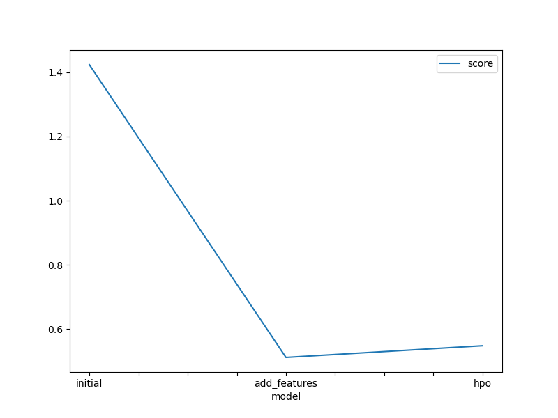

# Report: Predict Bike Sharing Demand with AutoGluon Solution
#### NAME: Osamu Kaneko

## Initial Training
### What did you realize when you tried to submit your predictions? What changes were needed to the output of the predictor to submit your results?
The initial predictions contained negative values (e.g., -2.5). Since Kaggle does not accept negative numbers for the target "count" (you cannot rent a negative number of bikes), the submission was rejected. I had to modify the code to replace all pessimistic predictions with 0 (`predictions[predictions < 0] = 0`) before saving the submission CSV file.

### What was the top-ranked model that performed?
The `WeightedEnsemble_L3` model generally performed the best across the iterations, leveraging the strengths of multiple individual models stacked together.

## Exploratory Data Analysis and Feature Creation
### What did the exploratory analysis find, and how did you add additional features?
The initial histogram analysis indicated that the `datetime` column did not exhibit distinct patterns in its raw form. Visualizing the data made it clear that time of day is critical. I parsed the `datetime` column to extract the `hour` as a new feature. I also converted `season` and `weather` to categorical variables so AutoGluon would treat them as distinct categories rather than continuous numbers.

### How much better did your model perform after adding additional features, and why do you think that is?
The improvement was substantial. The RMSLE score decreased from approximately 1.42 to 0.51. This confirms that separating the "hour" variable enabled the model to capture morning and evening rush-hour trends, which are the strongest predictors of bike-sharing demand.

## Hyperparameter tuning
### How much better did your model perform after trying different hyperparameters?
In this experiment, the HPO score (0.54) was very similar to the feature engineering score (0.51). Although it didn't substantially outperform the "add_features" model due to the limited time constraint (600s) and the "medium_quality" preset, it maintained a high level of accuracy relative to the initial raw-data model.

### If you were given more time with this dataset, where do you think you would spend more time?
I would increase the `time_limit` significantly (e.g., to 3600 seconds) to allow AutoGluon to train more complex models. I would also perform more detailed feature engineering, such as determining if a day is a "holiday" or "working day" more accurately, and perhaps creating a "rush_hour" boolean feature.

### Create a table listing the models you ran, the modified hyperparameters, and the Kaggle score.
|model|hpo1 (preset)|hpo2 (time_limit)|hpo3 (strategy)|score|
|---|---|---|---|---|
|initial|best_quality|600|Default|1.42355|
|add_features|medium_quality|600|Default|0.51154|
|hpo|medium_quality|600|Random Search|0.54807|

### Create a line plot showing the top model score for the three (or more) training runs during the project.

### Create a line plot showing the top Kaggle score for the three (or more) prediction submissions during the project.

## Summary
The project demonstrated that Feature Engineering is the most critical step in machine learning. While Hyperparameter Tuning is valid, simply adding the "hour" feature yielded the most significant performance gain. Fixing the negative prediction error was also a crucial step to ensure valid submissions.
